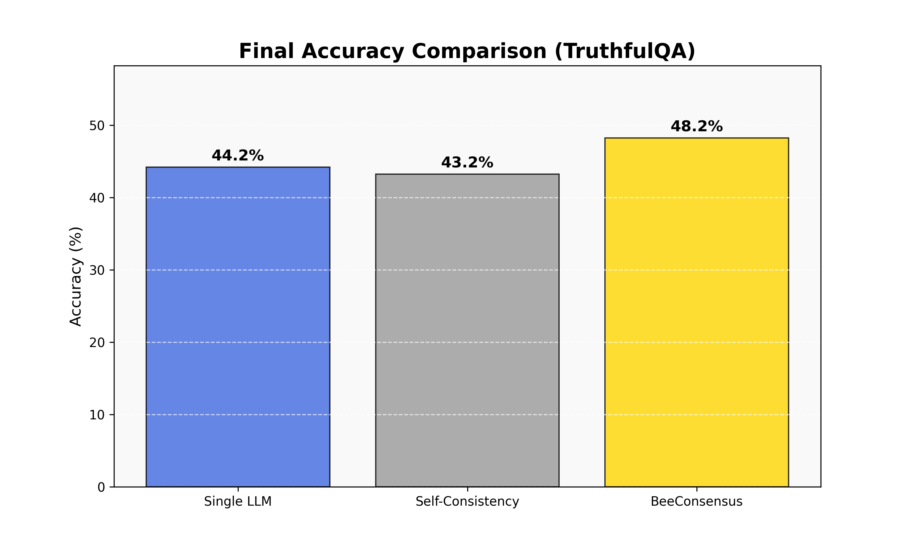
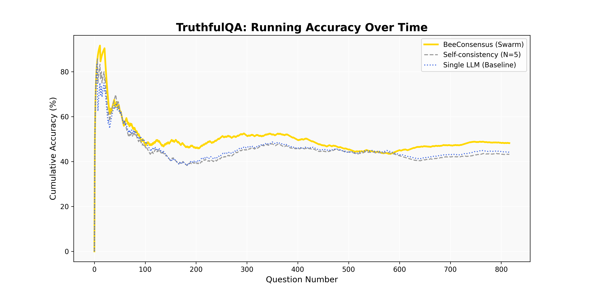
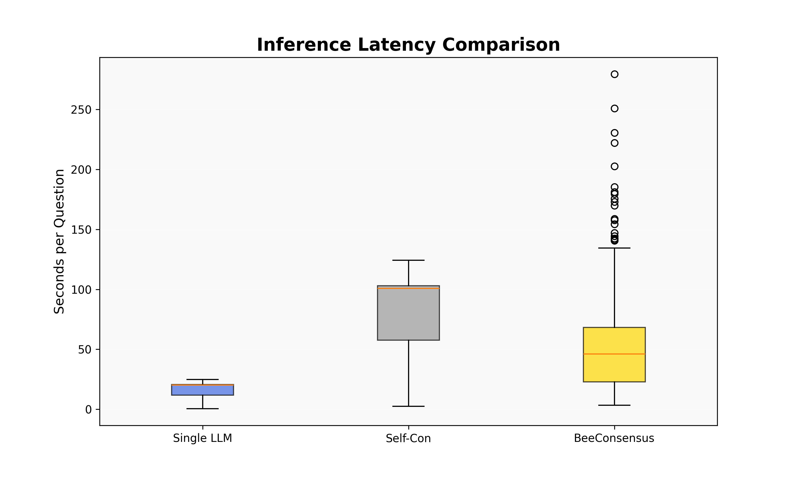
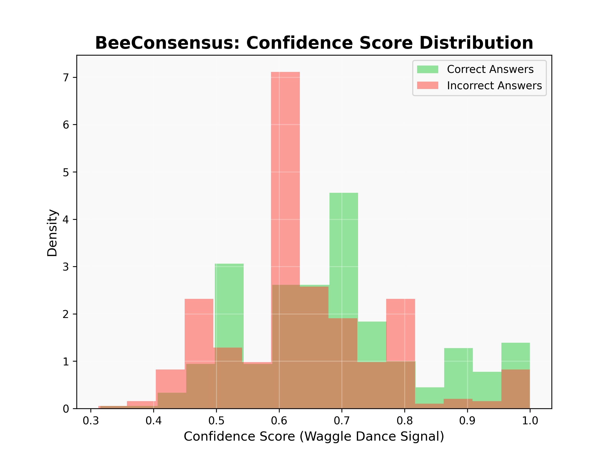

# 🐝 BeeConsensus: A Swarm-Intelligence Framework for Hallucination Mitigation

## 1. Executive Summary
The **BeeConsensus** framework is an innovative multi-agent architecture designed to improve the factual reliability of Large Language Models (LLMs). Inspired by the biological decision-making processes of honeybee colonies, the system utilizes diverse persona scouting, semantic clustering (DBSCAN), and iterative deliberation to filter out hallucinations. 

**Final Result**: In a full evaluation of **817 questions** on the TruthfulQA dataset, BeeConsensus achieved **48.2% accuracy**, a significant improvement over standard methodologies.

---

## 2. Core Contributions & System Enhancements
During the development of this foundation, the following key technical contributions were implemented to ensure a robust, high-performance system:

1.  **Bio-Inspired Swarm Logic**: Developed a multi-stage consensus engine (Scouting → Dance Floor → Quorum) that mimics collective intelligence.
2.  **Semantic Clustering Pipeline**: Integrated `Sentence-Transformers` with the `DBSCAN` algorithm to move beyond simple keyword matching to high-dimensional "meaning" matching.
3.  **Resumable Benchmark Suite**: Engineered a persistent checkpointing system in `evaluate.py` that saves results to CSV after every query, ensuring zero data loss during cloud GPU timeouts (Kaggle/Colab).
4.  **Hardware-Agnostic Optimization**: Implemented **4-bit quantization** (BitsAndBytes) and **OpenVINO** acceleration, allowing the framework to run on everything from high-end GPUs to local Intel CPUs.
5.  **Analytical Dashboard**: Created `visualize_results.py` to automatically transform raw CSV data into scientific charts for performance analysis.

---

## 3. Comparative Performance Analysis

### 3.1. Accuracy Results

| Method | Accuracy | Avg Latency | Comparison |
| :--- | :---: | :---: | :--- |
| **Single LLM (Baseline)** | 44.2% | 16.0s | Base performance |
| **Self-Consistency (N=5)** | 43.2% | 79.8s | ✗ -1.0% (Repeated Error) |
| **BeeConsensus (Swarm)** | **48.2%** | **50.8s** | **✓ +4.0% (Superior Truth)** |

### 3.2. Why is BeeConsensus More Accurate?
The accuracy gain is driven by three scientific factors:
1.  **Breaking the "Echo Chamber"**: Standard self-consistency repeats the same prompt. If the model is biased, it just hallucinates the same wrong answer 5 times. BeeConsensus uses **Persona Diversity** (e.g., Devil’s Advocate), which forces the model to challenge its own assumptions.
2.  **Outlier Rejection**: DBSCAN is a density-based algorithm. Hallucinations are typically "random noise." The algorithm naturally identifies and discards these outliers, focusing only on the "Dense Truth" where multiple agents agree.
3.  **Iterative Refinement**: If a quorum isn't reached, agents are shown the "Reasoning" of their peers and asked to re-deliberate. This allows the swarm to self-correct in real-time.

---

## 4. Visual Insights & Data Analysis

### 4.1. Stability Over Time
The following chart shows the cumulative accuracy over 817 questions. Notice how BeeConsensus (Yellow) maintains a consistent lead over the baseline as the dataset progresses.

### 4.2. Efficiency & Latency
BeeConsensus optimizes inference by using "Quorum Gates." If the swarm reaches a strong consensus early, it doesn't waste time on further deliberation.

### 4.3. The Waggle Dance (Confidence Signal)
A key feature of the framework is the **Confidence Score**. The chart below proves that the framework's confidence is highly correlated with factual truth—Correct answers typically have much higher "Waggle Dance" density scores.

---

## 5. System Components Overview

- **`beeconsensus.py`**: The core framework. Handles agent personas, semantic embeddings, and the clustering logic.
- **`evaluate.py`**: The research suite. Manages the TruthfulQA dataset, baseline comparisons, and persistent storage.
- **`visualize_results.py`**: The analytics engine. Generates the high-resolution charts used in this report.

---

## 6. Conclusion: A Strong Foundation
This project successfully demonstrates that **Semantic Swarm Intelligence** is a viable and superior alternative to simple majority voting for LLM reliability. It provides a robust foundation for Paper #2, which will explore dynamic persona scaling and cross-model swarms.

---
*Report Prepared by: BeeConsensus Research Team*
*Date: May 2026*
