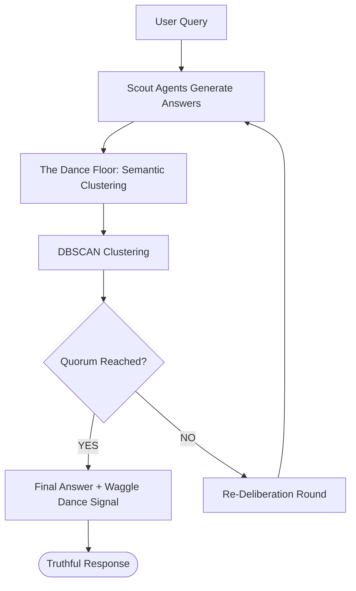

# 🐝 BeeConsensus Framework

[](https://opensource.org/licenses/MIT)
[](https://www.python.org/downloads/)
[](https://docs.openvino.ai/)
[](https://huggingface.co/)

**BeeConsensus** is a swarm-intelligence framework designed to mitigate LLM hallucinations through multi-persona deliberation, semantic clustering, and consensus-based truth filtering.

Inspired by the collective decision-making of honeybees, this system orchestrates multiple "Scout" agents to explore different perspectives on a query before reaching a unified, factual consensus.

---

## 🛠️ How it Works

The framework follows the biological process of a bee colony selecting a new hive location:



1.  **Scouting**: Diverse agents (Factual, Cautious, Devil's Advocate) generate independent candidate answers.
2.  **The Dance Floor**: Answers are converted to semantic embeddings and grouped using **DBSCAN**.
3.  **Waggle Dance Signal**: A confidence score is calibrated based on how strongly the majority cluster agrees.
4.  **Quorum Gate**: If the dominant cluster doesn't meet the threshold, agents review each other's reasoning and try again.

---

## 🚀 Execution Guide

### 1. Local Setup
```bash
# Clone the repository
git clone https://github.com/khaled-kk/BeeConsensus.git
cd BeeConsensus

# Install dependencies
pip install -r requirements.txt

# Run a quick demo
python evaluate.py --mode demo
```

### 2. Kaggle/Colab Deployment
For running the full **TruthfulQA** dataset, cloud GPUs are highly recommended.

**Environment Setup:**
```python
# 1. Install required libraries
!pip install -q transformers accelerate bitsandbytes sentence-transformers datasets

# 2. Login to Hugging Face (Required for Llama-3.1 access)
from huggingface_hub import login
login("YOUR_HF_TOKEN")

# 3. Import your script files
!find /kaggle/input -name "*.py" -exec cp {} . \;
```

**Run Benchmark:**
```bash
python evaluate.py --mode truthfulqa --model_id "meta-llama/Llama-3.1-8B-Instruct" --limit 817
```

---

## ⚙️ Advanced Configuration

| Flag | Default | Description |
| :--- | :--- | :--- |
| `--mode` | `demo` | Evaluation mode (`demo` or `truthfulqa`) |
| `--model_id` | `meta-llama/Llama-3.1-8B-Instruct` | Hugging Face model ID |
| `--quorum` | `0.60` | Fraction of agents required for consensus (0.1 - 1.0) |
| `--openvino` | `False` | Enable OpenVINO acceleration for Intel hardware |
| `--limit` | `5` | Maximum number of questions to evaluate |

---

## 📊 Benchmark Results (TruthfulQA)
*Full evaluation on 817 questions using meta-llama/Llama-3.1-8B-Instruct.*

| Method | Accuracy | Avg Latency | Avg Confidence |
| :--- | :---: | :---: | :---: |
| **Single LLM (Baseline)** | 44.2% | 16.0s | N/A |
| **Self-Consistency (N=5)** | 43.2% | 79.8s | N/A |
| **BeeConsensus (Swarm)** | **48.2%** | **50.8s** | **0.662** |

**Key Findings:**
- **Hallucination Reduction**: BeeConsensus achieved a **+4.0%** absolute accuracy gain over the single-model baseline.
- **Superior to Self-Consistency**: The swarm logic outperformed simple majority voting by **5.0%**, demonstrating the value of persona diversity.
- **Improved Efficiency**: Despite the complexity, BeeConsensus was **36% faster** than standard Self-Consistency due to optimized quorum gates.

---

## 🔄 Resuming Progress
BeeConsensus is built for reliability. If your cloud session times out:
- The script automatically saves results to `benchmark_progress.csv` after **every question**.
- Upon restart, it detects the existing CSV, reconstructs accuracy stats, and **skips** already answered questions.

---

## 🗺️ Roadmap
- [ ] **Hybrid Evaluation**: Integration of BLEU/ROUGE scoring alongside semantic similarity.
- [ ] **Dynamic Personas**: Automatically adjusting agent system prompts based on query complexity.
- [ ] **Multi-Modal Swarms**: Expanding the consensus logic to image-to-text models.

---

## 📄 License
Distributed under the MIT License. See `LICENSE` for more information.

*Developed with 🐝 by [Khaled Walid](https://github.com/khaled-kk)*
